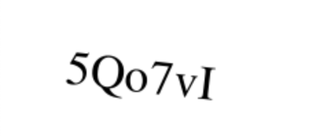

# @kumarshanu/captcha_generator


```markdown
## Description
A simple npm package that generates CAPTCHA images and corresponding text strings.

## Installation
```bash
npm install @kumarshanu/captcha_generator
```
## Usage
```javascript
import generate from '@kumarshanu/captcha_generator';

// Generate a captcha
const captcha = generate(200, 100, 6);
console.log(captcha);
```

## API

### generate(width: number, height: number, length: number): { image: string; text: string }
Generates a CAPTCHA image and returns an object with the base64-encoded image data and the corresponding text string.

- `width` (number): The width of the CAPTCHA image.
- `height` (number): The height of the CAPTCHA image.
- `length` (number): The length of the CAPTCHA text.

## Example
```javascript
import generate from '@kumarshanu/captcha_generator';

const captcha = generate(200, 100, 6);
console.log(captcha);
```

## License
This project is licensed under the MIT License - see the [LICENSE](LICENSE) file for details.
